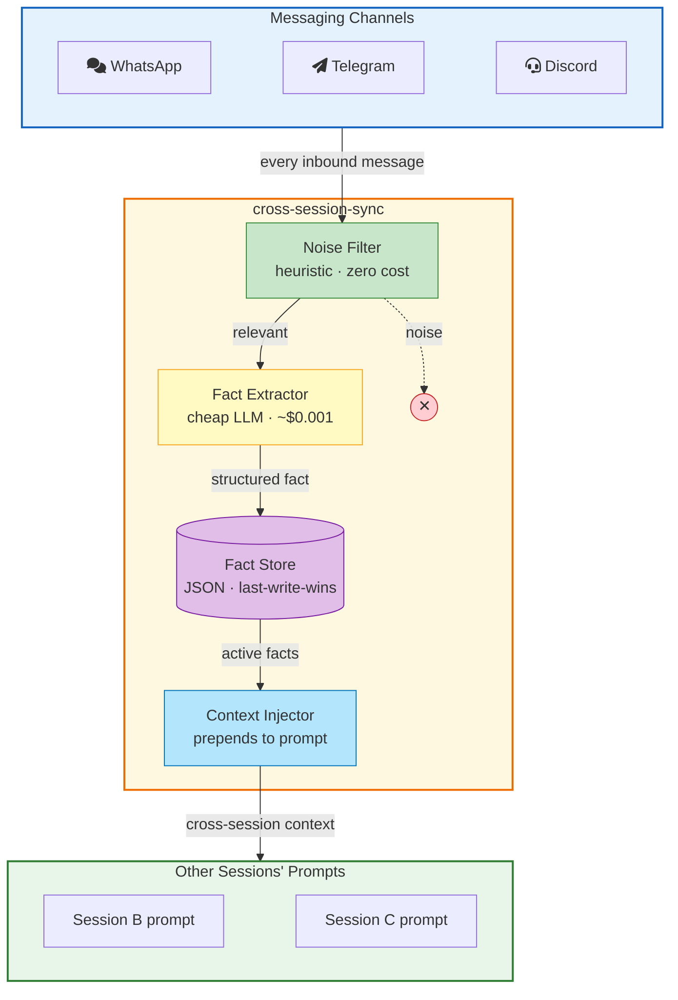

# Cross-Session Memory Synchronization for OpenClaw

An OpenClaw plugin that synchronizes relevant knowledge between independent messaging sessions in near real-time. When a user shares information on one channel (e.g., WhatsApp), that knowledge becomes available to the assistant on other channels (e.g., Slack, Telegram, Discord) — without merging conversation contexts or inflating token costs.

## The Problem

OpenClaw maintains independent conversation contexts per channel. A user who tells their WhatsApp assistant _"My meeting with Acme was moved to Thursday"_ would have to repeat that information when switching to Telegram or Discord. This plugin solves that automatically.

## How It Works



The plugin uses two OpenClaw hooks:

| Hook | Purpose |
|---|---|
| `message_received` | Captures inbound messages, filters noise, extracts facts, stores them |
| `before_prompt_build` | Injects relevant facts from other sessions into the system prompt |

## Key Features

- **Near real-time sync** — facts available within seconds across all sessions
- **Two-layer filtering** — heuristic filter eliminates ~80% of noise at zero cost; LLM handles ambiguous messages
- **Conflict resolution** — last-write-wins with supersedes chain preserves history
- **Session isolation** — facts from a session are only injected into _other_ sessions
- **Zero core modifications** — pure plugin using OpenClaw's official hook API
- **Cost-efficient** — ~$0.001 per LLM extraction call; ~200 tokens of prompt overhead per session

## Prerequisites

- **Node.js** 22.16+ (recommended: 24)
- **pnpm** package manager
- **OpenClaw** installed and configured (`openclaw onboard`)
- **OpenRouter API key** (or any OpenAI-compatible LLM provider)

## Installation

### 1. Clone this repository

```bash
git clone https://github.com/ricardobnjunior/openclaw-cross-session-sync.git
```

### 2. Copy into OpenClaw extensions

```bash
cp -r openclaw-cross-session-sync /path/to/openclaw/extensions/cross-session-sync
cd /path/to/openclaw
pnpm install
```

### 3. Enable the plugin

Add to your `~/.openclaw/openclaw.json`:

```json
{
  "plugins": {
    "entries": {
      "cross-session-sync": {
        "enabled": true
      }
    }
  }
}
```

### 4. Set your API key

```bash
export OPENROUTER_API_KEY="sk-or-v1-..."
```

### 5. Start the gateway

```bash
openclaw gateway run
```

You should see `Cross-session sync plugin loaded` in the logs.

## Running Tests

```bash
# From the OpenClaw root directory
pnpm vitest run extensions/cross-session-sync/tests/
```

### Test Suite

| File | Tests | What It Covers |
|---|---|---|
| `noise-filter.test.ts` | 19 | Noise rejection (lol, ok, emojis) and factual message acceptance |
| `fact-store.test.ts` | 4 | Save/retrieve, session exclusion, conflict resolution, persistence |
| `fact-extractor.test.ts` | 3 | LLM extraction, null handling, invalid JSON resilience |
| `integration.test.ts` | 3 | End-to-end mandatory scenarios |

### The 3 Mandatory Scenarios

| # | Scenario | Description |
|---|---|---|
| 1 | **Fact shared across sessions** | A fact stated on WhatsApp becomes available when querying from Slack |
| 2 | **Conflicts resolved gracefully** | "Favorite color is blue" → "Favorite color is green" → only green is active |
| 3 | **Noise not propagated** | Messages like "lol", "ok", "👍" are filtered and never reach other sessions |

## Manual Testing

1. Start the gateway with at least 2 channels configured (e.g., WhatsApp + Telegram):

   ```bash
   openclaw gateway run
   ```

2. **Channel A** (e.g., WhatsApp) — send a factual message:
   > "My meeting with Acme Corp was moved to Thursday"

3. Wait ~5 seconds for fact extraction.

4. **Channel B** (e.g., Telegram) — ask about it:
   > "What do you know about my meetings?"

5. The assistant on Channel B should mention the Acme meeting on Thursday — information it received from Channel A.

## Architecture

### Data Flow

```
User message → message_received hook → Noise Filter → Fact Extractor (LLM)
    → Fact Store (JSON) → before_prompt_build hook → System Prompt injection
```

### Conflict Resolution: Last-Write-Wins

```
t=100  WhatsApp: "Favorite color is blue"   → Fact A (active)
t=110  Slack:    "Favorite color is green"  → Fact B (active, supersedes A)
                                              Fact A (inactive)
```

Any session now sees only: _"Favorite color is green"_

### Selective Propagation

| Layer | Cost | Filters |
|---|---|---|
| **Heuristic** | Zero | Interjections, emojis, short messages, punctuation-only |
| **LLM** | ~$0.001/call | Ambiguous messages that pass heuristics |

## Project Structure

```
├── src/
│   ├── index.ts              # Entry point — registers hooks, wires components
│   ├── types.ts              # TypeScript interfaces (CrossSessionFact, etc.)
│   ├── noise-filter.ts       # Heuristic noise filter (zero LLM cost)
│   ├── fact-store.ts         # JSON fact store with conflict resolution
│   └── fact-extractor.ts     # LLM-based fact extraction
├── tests/
│   ├── noise-filter.test.ts  # Noise filter unit tests
│   ├── fact-store.test.ts    # Fact store unit tests
│   ├── fact-extractor.test.ts # Fact extractor unit tests
│   └── integration.test.ts   # End-to-end integration tests
├── docs/
│   ├── architecture.md       # Architecture document with diagrams
├── package.json              # npm manifest
└── openclaw.plugin.json      # OpenClaw plugin manifest
```

## Documentation

- **[Architecture Document](docs/architecture.md)** — System design, data flow diagrams, conflict resolution strategy, cost analysis, and trade-offs

## License

MIT
